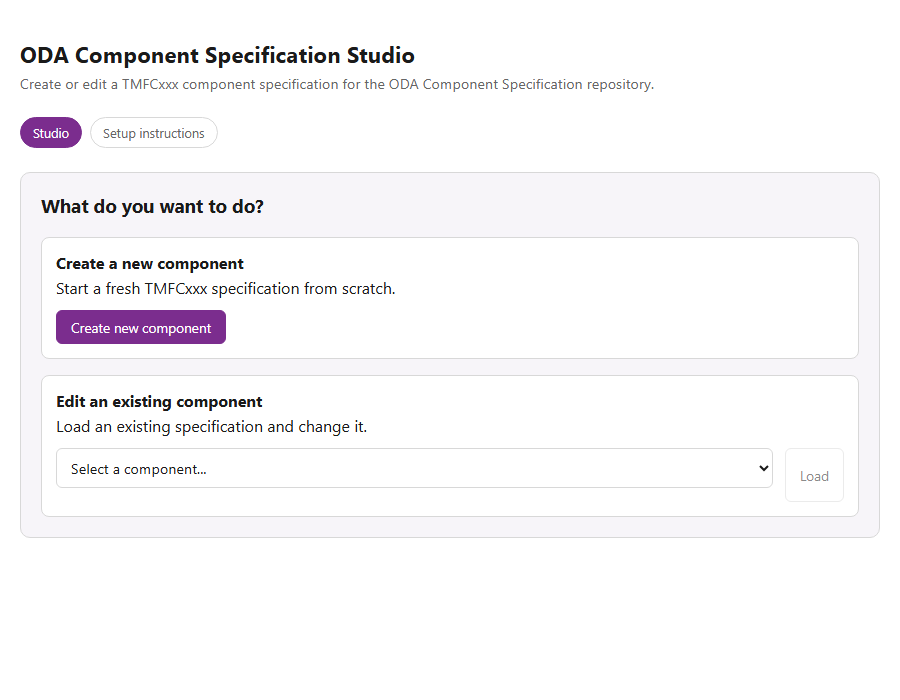
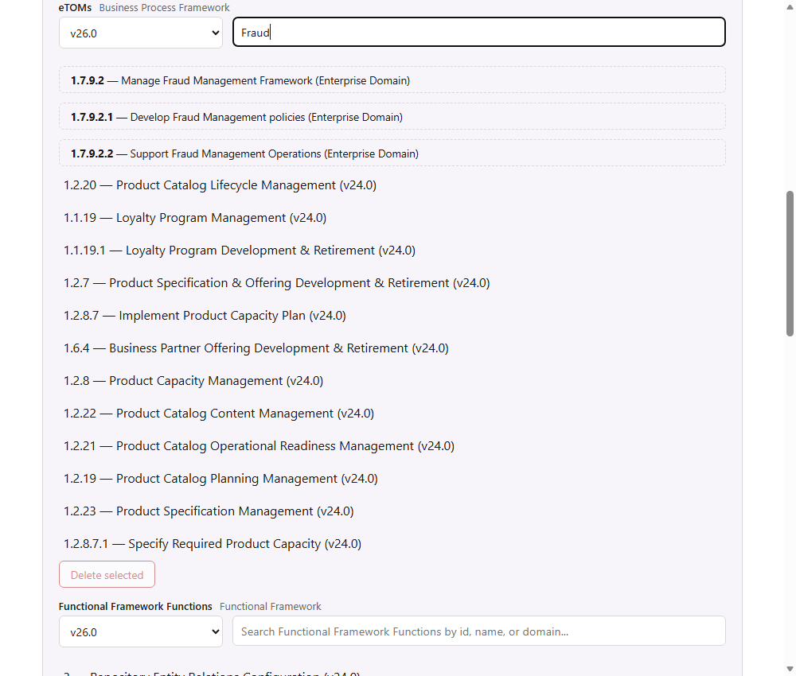

# ODA Component Specification Studio

A local web app for creating and editing [TMForum ODA](https://www.tmforum.org/oda/) component specification YAML files (`TMFCxxx-*.yaml`) without hand-editing YAML — a guided wizard instead of a text editor.



## Features

- **Create or edit** a component spec: auto-suggests the next free `TMFCxxx` id, or load and edit any existing component (id/name locked while editing to avoid orphaning its `ComponentConformanceProfile`/`RI`/`Diagrams` folders).
- **Exposed/Dependent APIs**: pick APIs by name from the repo's `apiIndex.json` catalog, then pick their actual resources and operations straight from that API's real swagger spec — no need to hand-type resource names or guess valid verbs.
- **eTOM, SID, and Functional Framework** pickers: search each taxonomy, add entries with a click, switch between multiple installed versions of each framework, and remove existing entries by selecting them and clicking Delete.
- **Published/Subscribed events**: published event names are constrained to the component's own exposed APIs and sourced live from that API's swagger title, so they can't drift from what the component actually exposes.
- **Schema validation** against the repo's `ci/component.schema.json` before saving, with inline error detail.
- **Setup tab** inside the app itself, showing live configuration status (repo/frameworks paths, git connection, available framework versions).



## Requirements

The app edits an existing local checkout of the [TMForum-ODA-Component-Specification](https://github.com/tmforum-rand/TMForum-ODA-Component-Specification) repo, plus a `frameworks/` folder containing the official TMForum GB921 (eTOM), GB922 (SID), and GB1033F (Functional Framework) Excel exports. These two directories must be siblings under one shared parent — enforced at server startup, not just a convention:

```
<workspace>/
  TMForum-ODA-Component-Specification-v1.1.0/   <- REPO_ROOT
  frameworks/                                    <- FRAMEWORKS_DIR
    GB921_..._v26.0.xlsx
    GB922_..._v26.0.xlsx
    GB1033F_..._v26.0.xlsx
    parse_reference_data.py
    etom_v26.0.json               <- generated
    sid_v26.0.json                <- generated
    functionalFramework_v26.0.json <- generated
```

Configurable via environment variables (`REPO_ROOT`, `FRAMEWORKS_DIR`, `PORT`); both directories must resolve under the same parent or the server refuses to start with a clear error.

To (re)generate the `frameworks/*.json` catalogs from the source spreadsheets:

```
cd frameworks
python parse_reference_data.py
```

Multiple versions of the same framework can coexist (drop a newer spreadsheet in alongside the old one and re-run); the app serves the latest version by default and lets you pick an older one per-field.

## Running in development

```
npm install --prefix server
npm install --prefix client
npm start --prefix server   # http://localhost:4310 (API)
npm run dev --prefix client # http://localhost:4320 (UI, proxies /api to the server)
```

## Building

**Portable exe** (single process serving both the API and the built UI):

```
npm install
npm run dist
# produces dist/ComponentSpecStudio.exe + dist/public/ - distribute both together
```

**Windows installer** (Start Menu shortcut, registered in Add/Remove Programs with a working uninstaller, no admin rights required — installs per-user to `%LOCALAPPDATA%\Programs\ComponentSpecStudio`):

```
npm run dist
cp dist/ComponentSpecStudio.exe installer/payload/
powershell -Command "Compress-Archive -Path dist/public/* -DestinationPath installer/payload/public.zip -Force"
cd installer
npx pkg . --targets node22-win-x64 --output ../dist/ComponentSpecStudio-Setup.exe
```

## Project layout

```
client/       React (Vite) wizard UI
server/       Express API - schema validation, swagger parsing, file save
installer/    Self-contained Windows installer (packaged via pkg)
dist/         Built portable exe + installer exe (tracked via Git LFS)
```

## License

Apache License 2.0 - see [LICENSE](LICENSE).
